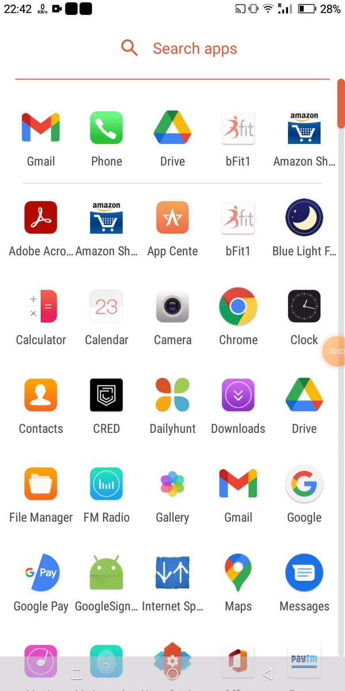
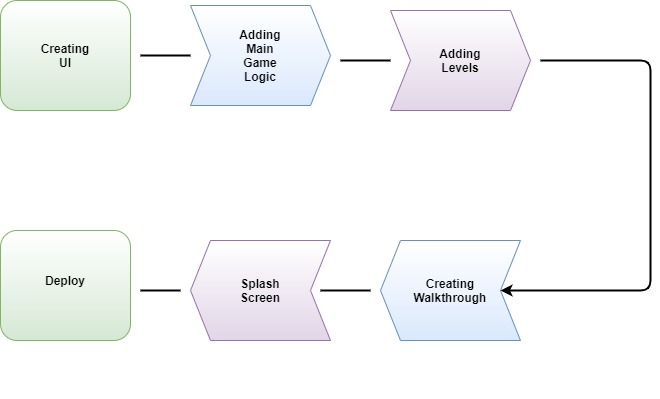

# **Project Information**
 
## Project Title
 
bFit-A Cognitive Game
 
## Project Description
Ever played brainy mobile games? Had fun? In this project you will be building one such game. This game is a reflex-memory testing game. Bascially the user has to follow along and click the colored (green) tiles as they keep popping. There will be a scoreboard keeping track of how good you click :p
You can get more about the project at (CRIO project)[https://www.crio.do/projects/java-android-game/] 
## Author
 
dk35840@gmail.com
<br>
 
## Collaborator(s)
 
kevinpaulose35@gmail.com, mridula@criodo.com
<br>
 
## Project Language(s)
 
Java
<br>
 
## Difficulty
Intermediate
<br>
 
## **Duration**
30 hours
 
## **Prerequisite(s)**
Core Java, Multithreading with some concepts of Android.
 
## **Skills to be learned**
Java, Splash screens, Multithreading, Mobile App Development
 
# **Project Metadata**
 
## **Project Id**
PROJECT_ANDROID_COGNITIVE_GAME
 
## **Slug URL**
 
java-android-game
 
## **Keywords**
java, android, game
 
## **Category**
Java,App Development,Android
 
## **Focus** 
Mobile App Development, Android, Splash screens
 
 
# **Overview**
 
## **Objective**
This project is focussed on creating a simple, fun, interactive brain training android game (using Java).
 
## Project Context
 
Android is a mobile operating system based on a modified version of the Linux kernel and some other open source softwares, designed primarily for touchscreen mobile devices such as smartphones and tablets. Android is developed by a consortium of developers known as the Open Handset Alliance and commercially sponsored by Google.
 
<br>
 
About 70 percent of Android smartphones run Google's ecosystem. Android was primarily built on Java (and Kotlin) language. Java is the best option when it comes to building core native android apps. Hence, here we will be using Java.
 
<br>
 
People spend hours at the gym, lifting weights, doing cardio exercises and following proper diets to keep their bodies physically fit. But what do people do to keep their brains in shape? Usually, when people are done at the gym they crash in front of a TV and put their brain into a passive mode where all the skills the mind has, i.e. memory, thinking and logical reasoning stagnates. Your brain is the most important part of your body and to not keep it fit is to invite laziness and lethargy into your life. Brain exercise is an approach to train the brain to perform at optimum levels and be sharp and strong even as old age acts to deteriorate your memory. In our daily life, we always feel stressed out. We exercise for the physical wellness of our body. But what do we actually do for the mental health? This game is like an exercise for the brain. Games of these kinds are categorically termed as [cognitive games](https://www.cognifit.com/brain-games). 
 
<br>
 
The game's walkthrough is shown below:
 
<br>

[](https://www.youtube.com/watch?v=gauJ-nwoD0M "bFit-A-Cognitive-Game - Click to Watch!")
 
<br>
 
The app can also be found at the [Amazon store](https://www.amazon.com/dp/B06VXYFNK3/ref=apps_sf_sta). If you face some issue with the Amazon store, you can download `Bfit_2.32` from [here](https://drive.google.com/file/d/0B_mUfZvrxlA5UDFqcE5xVk03S3c/view?usp=sharing) instead.
 
<br>
 
So do try the app first!!
 
 
## Project Stages
 
The project can be broadly classified into 4 sections:-
1) Setting up the UI for the game with buttons and other game screens
2) Adding logic to the game
3) Creating a walkthrough/guided tour of the game to introduce first-time users to our app.
4) Creating a splash screen to load important files in the background.
 

<br>
 
Each of these stages are covered in detailed multiple milestones ahead.
 
 
## High-Level Approach 
 
- Firstly we build the UI for the game. Ideally, it can be 12 x 10 clickable boxes. Also, three more buttons for the start, stop and help section should be optional.
- Build the controller of the app or the logic i.e. how it works.
- Add game levels that keep up the user's excitement.
- Then learn how to create a walkthrough of the game to introduce first-time users to our app.
- Create a splash screen. It is the introductory screen that shows an image when we load the game for the first time ever; to actually download important files in the background.
- Finally, we will deploy the app by using "best practice of deploying Android apps" like obfuscating, modifying apps for multiple screens etc.
 
 
## Applications 
 
- It can be used as an alternate for the cognitive game.
- These types of cognitive i.e. brain-training games are de-stressing activites. So they can serve as excellent relaxants.
- Improves attention and concentration.
- Improves the brain's speed.
- Enhances multitasking skills.
 
## Credits 
 
This is an android app adaptation of the [brainmetrix](https://www.brainmetrix.com/).
 
 
# **Task_id = 1**
 
## Task Title
 
Environment setup
 
## Setting up the development environment
 
First you need to set up the development environment for the android. For this, you need to install Android Studio, Java 8 or higher.
 
## Requirements
 
- Install Java (JDK 1.8)
- Install Android Studio
- Do the environment setup for Java on your local machine
- Create a blank android project by choosing the Empty Activity template.
- Provide the project name and the base package and Minimum SDK of API .
- Make sure the [version](https://source.android.com/setup/start/build-numbers) used is API Level 23 or later.
- Make sure you have minimum RAM of 8 GB installed on your system and SSD is preferable.
 
 
<br>
 
Check the version of java to know whether you have successfully installed it or not-
 
```java
java -version
```
 
Congratulations!!! Your initial set up is done!
 
### References
 
- [Installing Java](https://docs.oracle.com/javase/8/docs/technotes/guides/install/install_overview.html)
- [Installing Android Studio](https://developer.android.com/studio)
- [What is API level?](http://www.dre.vanderbilt.edu/~schmidt/android/android-4.0/out/target/common/docs/doc-comment-check/guide/appendix/api-levels.html)
 
 
## Expected Outcome
 
You should be able to set up the initial development environment required to develop the game.
 
For more instruction visit my Projet at (CRIO project)[https://www.crio.do/projects/java-android-game/]  

